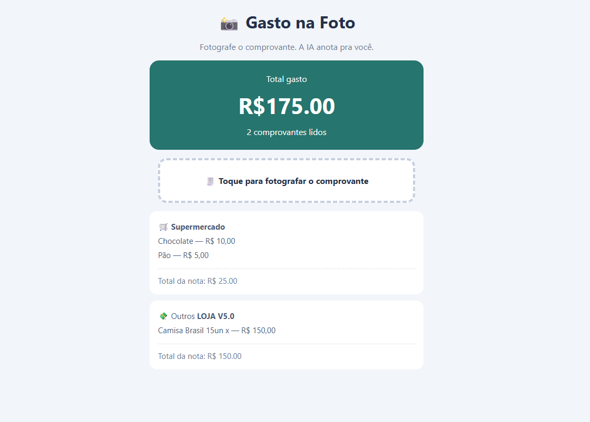

## 📸 Projeto Controle Financeiro

Participei da “Missão Programação com IA do zero do DevClub”, onde criamos uma aplicação web que utiliza **Inteligência Artificial** para ler fotos de notas fiscais e organizar os gastos automaticamente.

### Tecnologias utilizadas
- HTML5
- CSS3
- JavaScript
- 🤖 Puter AI

### Funcionalidades
- Leitura de comprovantes por imagem
- Extração das informações com IA
- Cálculo do total gasto

### Manutenção realizada

A funcionalidade de **contagem de comprovantes lidos** apresentava um problema e permanecia exibindo "0 comprovantes lidos" mesmo após o carregamento das imagens.

Realizei a identificação e correção do código responsável pela contagem, fazendo com que a quantidade de comprovantes processados seja atualizada automaticamente na tela e com a concordância gramatical correta.

### 🖥️ Projeto funcionando

